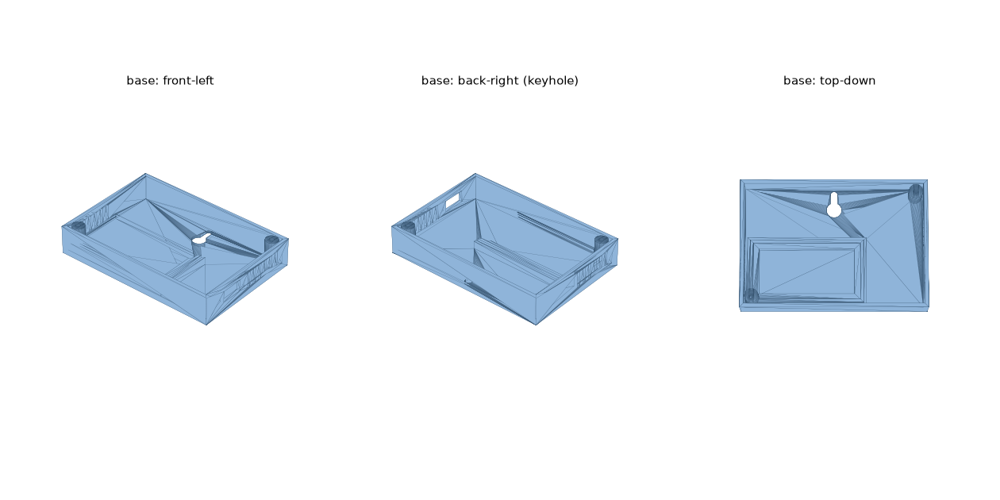
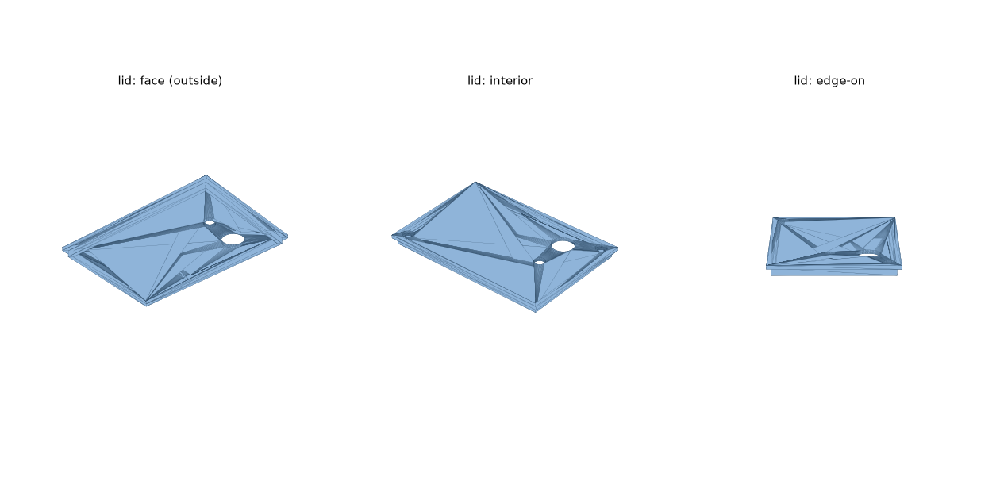

# Multisensor Enclosure

3D-printed two-part case for the room multisensor
([docs/08-presence-sensors.md](../../docs/08-presence-sensors.md)):
ESP32 DevKit 38-pin + LD2410C + AM312 + BME280 + BH1750.




## Parts

| File | What |
|---|---|
| `base.stl` | Wall-mount back box: keyhole hanger, ESP32 ledge pocket, USB-C cutout (right wall), vent slots both sides, two M3 bosses |
| `lid.stl` | Sensor faceplate: 1 mm radar window with interior locating pocket (upper-left), Ø12.6 PIR lens hole (upper-right), Ø6 light aperture, M3 countersunk screw holes |
| `generate_enclosure.py` | Parametric source — edit the `P` dict, rerun to regenerate |

Outer size 96 × 66 × ~28 mm assembled.

## Printing

- **Material:** PETG or PLA. White/light colors keep radar attenuation and
  solar gain low.
- **Orientation:** base on its back, lid face-down. **No supports** needed.
- **Settings:** 0.2 mm layers, 3 perimeters, 20 % infill. The 1 mm radar
  window prints as ~5 solid top layers — that's expected and fine; 24 GHz
  passes through printed plastic easily.

## Assembly

1. Drop the ESP32 into its ledge pocket, USB-C facing the right-wall cutout.
2. Seat the LD2410C in the lid pocket, radar face against the thin window;
   a dab of hot glue holds it.
3. AM312's lens pokes through the Ø12.6 hole (friction fit, glue if loose).
4. Glue the BH1750 behind the Ø6 aperture, sensor over the hole.
5. Mount the BME280 low on the left side near the vent slots, away from the
   ESP32 (its heat skews readings).
6. Wire per docs/08, press the lid on, drive two M3 self-tapping screws.
7. Hang on a wall screw via the back keyhole, or shelf-stand it.

## Regenerating

```bash
pip install manifold3d trimesh numpy
python generate_enclosure.py
```

Every dimension (tolerances, hole positions, box size) is a named parameter
in `P`. v1 note: printed but not yet test-fitted — expect to nudge `clear`
(lid fit) and the ESP32 pocket after the first print.
